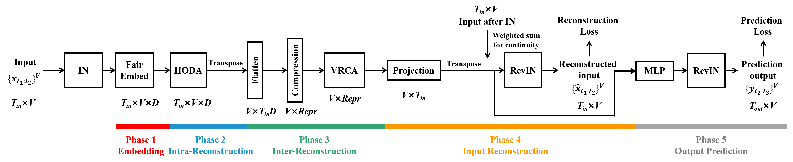
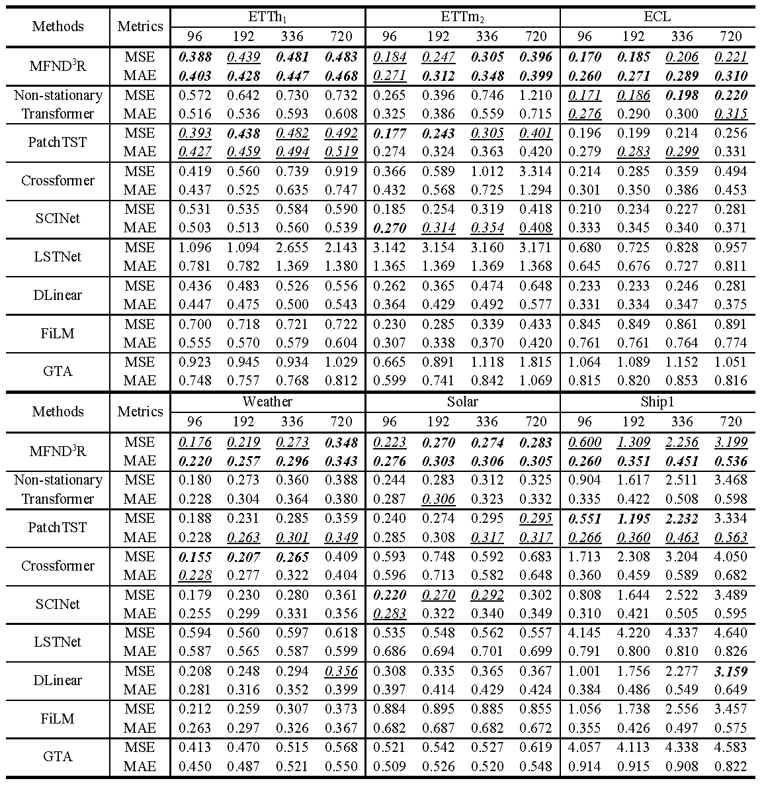
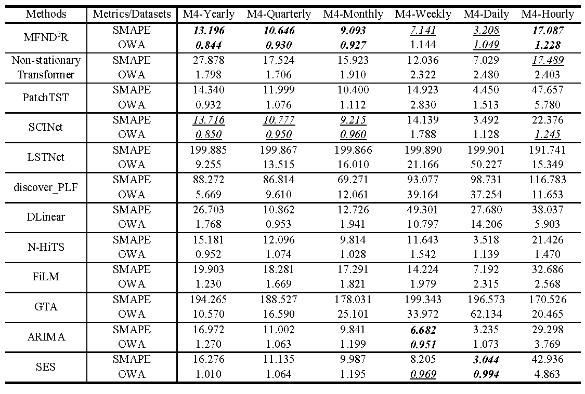

# MFND<sup>3</sup>R: Multivariate Forecasting Network with Deep Data-Driven Reconstruction for Engineering Application


This is the origin Pytorch implementation of MFND<sup>3</sup>R in the following paper: 
[MFND<sup>3</sup>R: Multivariate Forecasting Network with Deep Data-Driven Reconstruction for Engineering Application](Manuscript submitted to EAAI).

## The Entire Architecture of MFND<sup>3</sup>R
<p align="center">

<br><br>
<b>Figure 1.</b> The entire architecture of MFND<sup>3</sup>R.
</p>


## Requirements

- Python 3.8.8
- matplotlib == 3.3.4
- numpy == 1.20.1
- pandas == 1.2.4
- scipy == 1.9.0
- scikit_learn == 0.24.1
- torch == 1.11.0

Dependencies can be installed using the following command:
```bash
pip install -r requirements.txt
```

## Data

ETT, ECL and weather dataset were acquired at: [here](https://drive.google.com/drive/folders/1ZOYpTUa82_jCcxIdTmyr0LXQfvaM9vIy?usp=sharing). Solar and PEMS dataset were acquired at: [here](https://drive.google.com/drive/folders/1Gv1MXjLo5bLGep4bsqDyaNMI2oQC9GH2?usp=sharing). M4 dataset was acquired at: [M4](https://github.com/Mcompetitions/M4-methods). Ship dataset was in `./data/Ship/` and its raw data was in [https://coast.noaa.gov/htdata/CMSP/AISDataHandler/2022/index.html](https://coast.noaa.gov/htdata/CMSP/AISDataHandler/2022/index.html).

### Data Preparation
After you acquire raw data of all datasets, please separately place them in corresponding folders at `./MFND3R/data`. 

We place ETT in the folder `./ETT-data`, ECL in the folder `./electricity`  and weather in the folder `./weather` of [here](https://drive.google.com/drive/folders/1ZOYpTUa82_jCcxIdTmyr0LXQfvaM9vIy?usp=sharing) (the folder tree in the link is shown as below) into folder `./data` and rename them from `./ETT-data`,`./electricity` and `./weather` to `./ETT`, `./ECL` and`./weather` respectively. We rename the file of ECL from `electricity.csv` to `ECL.csv` and rename its last variable from `OT` to original `MT_321`.

```
|-autoformer
| |-ETT-data
| | |-ETTh1.csv
| | |-ETTh2.csv
| | |-ETTm1.csv
| | |-ETTm2.csv
| |
| |-electricity
| | |-electricity.csv
| |
| |-weather
| | |-weather.csv
```

We place Solar in the folder `./financial` and PEMS in the folder `./PEMS` of [here](https://drive.google.com/drive/folders/1Gv1MXjLo5bLGep4bsqDyaNMI2oQC9GH2?usp=sharing) (the folder tree in the link is shown as below) into the folder `./data` and rename them as `./Solar` and `./PEMS` respectively. 

```
|-dataset
| |-financial
| | |-solar_AL.txt
| |
| |-PEMS
| | |-PEMS08.npz
```

As for M4 dataset, we place the folders `./Dataset` and `./Point Forecasts` of [M4](https://github.com/Mcompetitions/M4-methods) (the folder tree in the link is shown as below) into the folder `./data/M4`. Moreover, we unzip the file `./Point Forecasts/submission-Naive2.rar` to the current directory.

```
|-M4-methods
| |-Dataset
| | |-Test
| | | |-Daily-test.csv
| | | |-Hourly-test.csv
| | | |-Monthly-test.csv
| | | |-Quarterly-test.csv
| | | |-Weekly-test.csv
| | | |-Yearly-test.csv
| | |-Train
| | | |-Daily-train.csv
| | | |-Hourly-train.csv
| | | |-Monthly-train.csv
| | | |-Quarterly-train.csv
| | | |-Weekly-train.csv
| | | |-Yearly-train.csv
| | |-M4-info.csv
| |-Point Forecasts
| | |-submission-Naive2.rar
```

Then you can get the folder tree shown as below:

```
|-data
| |-ECL
| | |-ECL.csv
| |
| |-ETT
| | |-ETTh1.csv
| | |-ETTh2.csv
| | |-ETTm1.csv
| | |-ETTm2.csv
| |
| |-M4
| | |-Dataset
| | | |-Test
| | | | |-Daily-test.csv
| | | | |-Hourly-test.csv
| | | | |-Monthly-test.csv
| | | | |-Quarterly-test.csv
| | | | |-Weekly-test.csv
| | | | |-Yearly-test.csv
| | | |-Train
| | | | |-Daily-train.csv
| | | | |-Hourly-train.csv
| | | | |-Monthly-train.csv
| | | | |-Quarterly-train.csv
| | | | |-Weekly-train.csv
| | | | |-Yearly-train.csv
| | | |-M4-info.csv
| | |-Point Forecasts
| | | |-submission-Naive2.csv
| |
| |-PEMS
| | |-PEMS08.npz
| |
| |-Ship
| | |-Ship1.csv
| | |-Ship2.csv
| |
| |-Solar
| | |-solar_AL.txt
| |
| |-weather
| | |-weather.csv

```

## Usage
Commands for training and testing MFND<sup>3</sup>R of all datasets are in `./scripts/MFND3R.sh`.

More parameter information please refer to `main.py`.

We provide a complete command for training and testing MFND<sup>3</sup>R:

```
python -u main.py --model <model> --mode <mode> --data <data> --root_path <root_path> --features <features> --input_len <input_len> --pred_len <pred_len> --ODA_layers <ODA_layers> --VRCA_layers <VRCA_layers> --d_model <d_model> --learning_rate <learning_rate> --dropout <dropout> --batch_size <batch_size> --use_RevIN --train_epochs <train_epochs> --patience <patience> --itr <itr>
```

Here we provide a more detailed and complete command description for training and testing the model:

| Parameter name | Description of parameter |
|:---:|:---:|
| model | The model of experiment. This can be set to `MFND3R` |
| mode | Forecasting format |
|      data      | The dataset name  |
|   root_path    | The root path of the data file  |
|   data_path    | The data file name  |
|    features    | The forecasting task. This can be set to `M`,`S` (M : multivariate forecasting, S : univariate forecasting |
|     target     |  Target feature in `S` task   |
|  checkpoints   | Location of model checkpoints |
| input_len |Input sequence length |
| pred_len | Prediction sequence length |
| enc_in | Input size |
| c_out | Output size  |
| d_model | Dimension of model |
| representation | Representation dims in the end of the intra-reconstruction phase |
| dropout | Dropout  |
| ODA_layers |The number of ODA layers |
| VRCA_layers |The number of VRCA layers |
| alpha | The significant level of Cucconi test |
| itr | Experiments times |
| train_epochs | Train epochs of the second stage |
| batch_size | The batch size of training input data in the second stage |
| patience | Early stopping patience  |
| learning_rate | Optimizer learning rate |
| loss | Loss function |
| use_RevIN | Whether to use RevIN|


## Results

The experiment parameters of each data set are formated in the `MFND3R.sh` files in the directory `./scripts/`. You can refer to these parameters for experiments, and you can also adjust the parameters to obtain better mse and mae results or draw better prediction figures.

<p align="center">

<br><br>
<b>Figure 2.</b> Multivariate forecasting results
</p>

<p align="center">

<br><br>
<b>Figure 3.</b> Univariate forecasting results
</p>


## Contact
If you have any questions, feel free to contact Li Shen through Email (shenli@buaa.edu.cn) or Github issues. Pull requests are highly welcomed!
